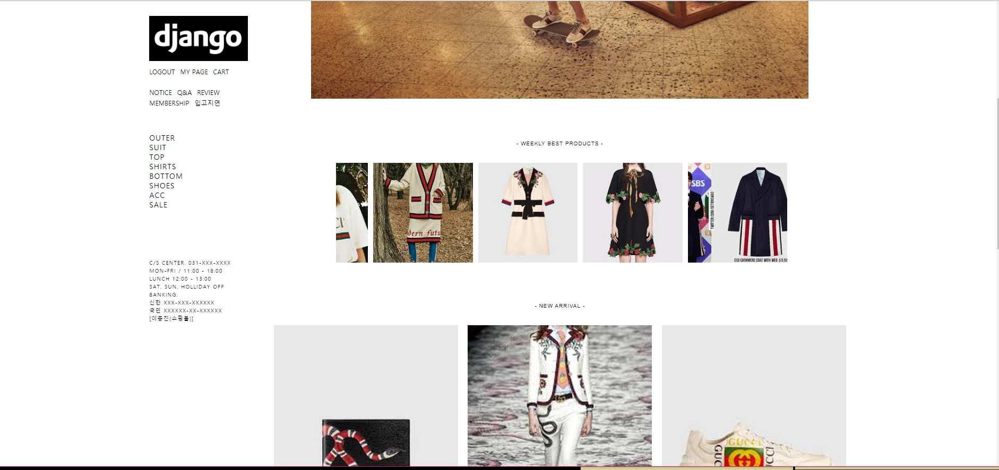

# # Shopping Mall Project
쇼핑몰의 기본 기능 구현에 집중하여 진행한 프로젝트.


## # My Shop



## # 주요기능

* 메인화면(leftSide)
  - 로그인, 마이페이지, 장바구니로 향할 수 있는 메뉴들이 있습니다.
  - 공지사항이나 질문 등의 게시판으로 향하는 메뉴들이 있습니다.
  - 카테고리별로 상품이 모여있는 페이지로 향할 수 있습니다.
  - 카테고리는 관리자가 임의로 추가할 수 있습니다.
  
  ```
        //상품 카테고리 별로 페이지에 카테고리에 해당하는 상품을 보여주도록 함.
        def show_category(request, category_id):
          categories = Category.objects.all()
          category = Category.objects.get(pk=category_id)
          products = Product.objects.filter(category=category).order_by('pub_date')
          lank_products = Product.objects.filter(category=category).order_by('-hit')[:4]
          paginator = Paginator(products, 5)
          page = request.GET.get('page')
          try:
              products = paginator.page(page)
          except PageNotAnInteger:
              products = paginator.page(1)
          except EmptyPage:
              products = paginator.page(paginator.num_pages)
          context = {'lank_products': lank_products, 'products': products, 'category': category, 'categories': categories}
          return render(request, 'shop/category.html', context)

  ```
  
* 메인화면(rightSide)
  - 쇼핑몰의 주력 상품에 대한 화보를 사이드 최상단에 슬라이드로 보여줍니다.
  - WEEKLY BEST PRODUCTS로 Product 데이터에서 조회(hit)가 가장 많은 순으로 슬라이드를 만들어 보여줍니다.
  - NEW ARRIVAL로 Product 데이터를 날짜순으로 정렬하여 나열해 보여줍니다.
  
* 로그인과 회원가입
  - 로그인과 회원가입은 장고의 기본 User 모델을 사용하였습니다.

* MY PAGE
  - 회원이 주문한 상품의 주문내역을 볼 수 있습니다. 
  
* NOTICE
  - 쇼핑몰의 공지사항을 확인할 수 있으며 admin 페이지에서 공지사항을 관리자가 입력할 수 있습니다.
  
* PRODUCT PAGE 
  - 카테고리 내에서 조회수(hit)가 많은 순으로 상단에 4개까지 나열해줍니다.
  - 카테고리에 해당하는 상품을 올려진 시간 순으로 나열합니다.
  
* PRODUCT DETAIL
  - 상품의 사진과 관리자가 지정한 상품의 이름, 상품에 대한 설명이 포함됩니다.
  - 상품의 가격과 상품을 구매할 시 적립되는 포인트(10%)가 보여집니다.
  - 수량을 선택할 수 있습니다.
  - 선택한 상품을 장바구니에 담거나 주문페이지로 넘어갈 수 있습니다.
  
    ```
        //장바구니에 담거나 구매할 수 있도록 함.
        @login_required
        def cart_or_buy(request, pk):
            quantity = int(request.POST.get('quantity'))
            product = Product.objects.get(pk=pk)
            user = request.user
            categories = Category.objects.all()
            initial = {'name': product.name, 'amount': product.price, 'quantity': quantity}
            cart = Cart.objects.filter(user=user)
            if request.method == 'POST':
                if 'add_cart' in request.POST:
                    for i in cart :
                        if i.products == product:
                            product = Product.objects.filter(pk=pk)
                            Cart.objects.filter(user=user, products__in=product).update(quantity=F('quantity') + quantity)
                            messages.success(request,'장바구니 등록 완료')
                            return redirect('shop:cart', user.pk)

                    Cart.objects.create(user=user, products=product, quantity=quantity)
                    messages.success(request, '장바구니 등록 완료')
                    return redirect('shop:cart', user.pk)

                elif 'buy' in request.POST:
                    form = OrderForm(request.POST, initial=initial)
                    if form.is_valid():
                        order = form.save(commit=False)
                        order.user = user
                        order.quantity = quantity
                        order.products = product
                        order.save()
                        return redirect('shop:order_list', user.pk)

                    else:
                        form = OrderForm(initial=initial)

                    return render(request, 'shop/order_pay.html', {
                        'form': form,
                        'quantity': quantity,
                        'iamport_shop_id': 'iamport',  # FIXME: 가맹점코드
                        'user': user,
                        'product': product,
                        'categories': categories,
                    })

  ```
* 상품 구매
  - 선택한 상품의 수량에 따른 가격을 정해 구매할 수 있습니다. 
  - 선택을 완료하여 구매를 누르면 결제가 이루어지도록 iamport를 연동하였습니다.
  
